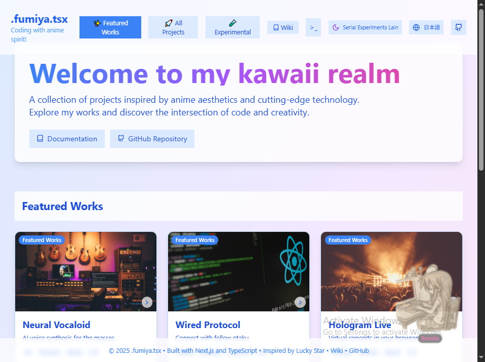
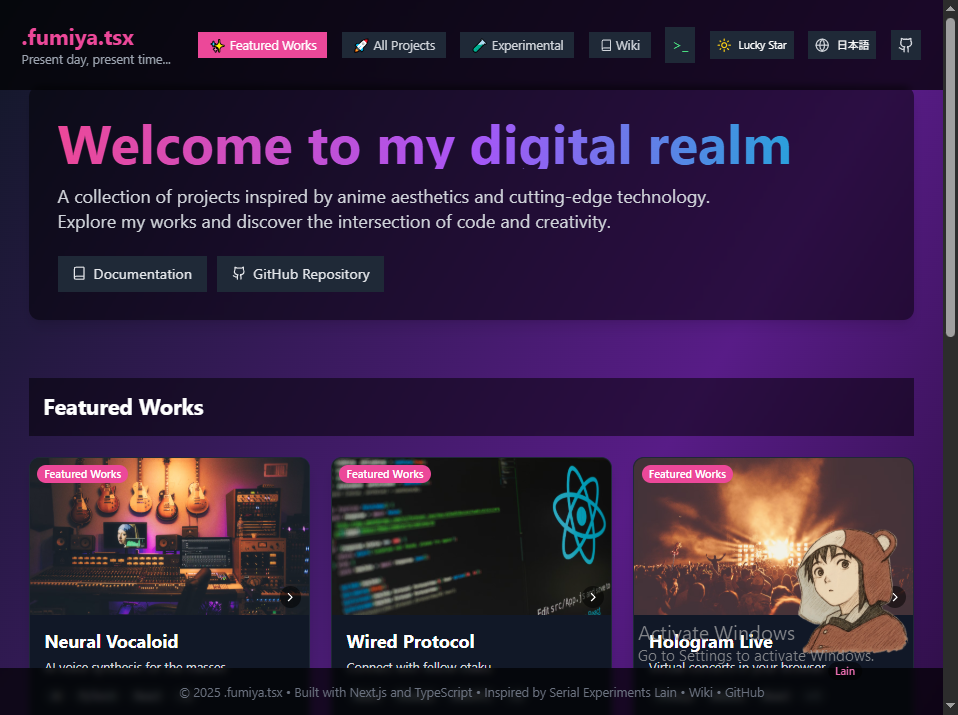

# Anime Portfolio

A developer portfolio template with two original watercolor characters, each with a theme of her own: Crystalline, a light theme, and Weltschmerz, a dark one.

[](https://anime-portfolio.github.io/app/)
[](LICENSE)





## Themes and characters

Crystalline is the light theme, in soft watercolor blues and lilacs. Its companion is Crystalline-chan, a girl who walks with a deer made of glass.

Weltschmerz is the dark theme, quiet and heavy, in deep purples and ink. Its companion is Weltschmerz-chan, a girl who feels the weight of the world.

Both characters and their illustrations are original work by Aesthetic Vulpes (didvc). The switch in the header moves between the two themes.

## Features

The current theme's character floats in the corner of the page and says a short line now and then, or when clicked. Pages change with a glitch transition and load behind an ASCII animation, cards shift slightly with the mouse, and a terminal-style interface can browse the projects by command. There are a few easter eggs, including the Konami code. The interface is available in English and Japanese, and a small wiki holds the help and privacy pages.

## Tech stack

Next.js 15 (App Router, exported as a static site), React 19, TypeScript, Tailwind CSS 3, Framer Motion, and Radix UI components in the shadcn/ui style, with Lucide icons. The demo is hosted on GitHub Pages.

## Quick start

Requires Node.js 18.18 or later, and npm or pnpm.

1. Clone the repository:
   ```bash
   git clone https://github.com/anime-portfolio/app.git
   cd app
   ```

2. Install the dependencies:
   ```bash
   npm install
   # or
   pnpm install
   ```

3. Start the development server:
   ```bash
   npm run dev
   # or
   pnpm dev
   ```

4. Open [http://localhost:3000](http://localhost:3000).

### Build

```bash
npm run build
```

The site is exported as static files to `out/`. To serve it from a subpath, such as `/app/` on GitHub Pages, set `PAGES_BASE_PATH=/app` for the build.

## Customization

### Profile

Edit `data/portfolio-data.tsx`:

```typescript
export const profileData: ProfileData = {
  name: {
    en: "Your Name",
    ja: "あなたの名前",
  },
  role: {
    en: "Your Role",
    ja: "あなたの役割",
  },
  // ... more configuration
}
```

Social links and the contact email are optional; the page only shows the ones that are set.

### Projects

Add your projects to the `works` array in the same file:

```typescript
{
  id: "your-project",
  title: "Project Title",
  description: "Project description...",
  images: ["image1.jpg", "image2.jpg"],
  link: "https://your-project.com",
  repo: "https://github.com/your-username/project",
  tags: ["React", "TypeScript", "Next.js"],
  date: "2024-12",
  featured: true,
}
```

### Themes

The two themes live in `contexts/theme-context.tsx`. A new theme is another configuration of the same shape, with its own colors and floating character:

```typescript
export const customTheme: PortfolioPageProperties = {
  type: "fullscreen",
  styles: ["anime", "custom"],
  gradientBg: "bg-gradient-to-br from-custom-900 to-custom-100",
  // ... more customization
}
```

## Project structure

```
app/
├── app/                    # Next.js App Router
├── components/             # React components
│   ├── ui/                # Reusable UI components
│   ├── work-card.tsx      # Project card component
│   ├── floating-girl.tsx  # Floating character component
│   └── terminal-ui.tsx    # Terminal interface
├── contexts/              # React contexts, including the themes
├── data/                  # Portfolio data and configuration
├── hooks/                 # Custom React hooks
├── lib/                   # Utilities, translations and wiki articles
├── public/                # Static assets, including the character images
├── styles/                # Global styles
└── types/                 # TypeScript type definitions
```

## Deployment

The demo deploys to GitHub Pages through `.github/workflows/pages.yml`, which builds and publishes the site on every push to `master`. The exported `out/` folder also works on Vercel, Netlify or any other static host.

## Contributing

Contributions are welcome. Fork the repository, then:

1. Create a feature branch: `git checkout -b feature/your-feature`
2. Commit your changes: `git commit -m "Add your feature"`
3. Push the branch: `git push origin feature/your-feature`
4. Open a pull request

Follow the existing code style, add tests for new features where it makes sense, update the documentation, and check your change in more than one browser and in both themes. See [CONTRIBUTING.md](./CONTRIBUTING.md) for the details.

Questions and ideas go to [Discussions](https://github.com/anime-portfolio/app/discussions), and bugs to [Issues](https://github.com/anime-portfolio/app/issues).

## License

The code is released under the [MIT License](LICENSE). The character illustrations (Crystalline-chan and Weltschmerz-chan, in `public/images/`, `public/og.png` and the screenshots) are licensed under [CC BY 4.0](LICENSE-CC-BY-4.0).

<!-- BEGIN gh-mutual-linking -->

---

### Related projects

- [bio](https://github.com/didvc/bio): Profile writings and translations of Vulpes (didvc)
- [astro-html-editor](https://github.com/didvc/astro-html-editor): Self-hosted HTML editor with live preview. Astro SSR + plain JavaScript, server-side file persistence.
- [awesome-template](https://github.com/didvc/awesome-template)
- [react-image-editor](https://github.com/didvc/react-image-editor): A powerful web-based image editor built with React, TypeScript, and Canvas API. Features real-time filters, transformations, crop tool, and…
- [image-gallery-app](https://github.com/didvc/image-gallery-app): Modern minimalist image gallery built with Express.js and Vue.js - featuring drag & drop upload, responsive design, and clean aesthetics
- [vibe-go-image-gallery](https://github.com/didvc/vibe-go-image-gallery): Modern image gallery application built with Go and Vue.js featuring SEO optimization, responsive design, and automatic thumbnail generation.
- [html-bio-generator](https://github.com/didvc/html-bio-generator): A modern, intuitive tool for creating beautiful HTML bio pages with ease. Built with Next.js, TypeScript, and Tailwind CSS. Perfect for…
- [app](https://github.com/AI-marriage/app): AIを使った結婚証明書ジェネレーター - ChatGPTとの特別な瞬間を美しい証明書で記録しましょう
- [text-to-speech](https://github.com/didvc/text-to-speech): VoiceFlow - Modern text-to-speech web application with real-time word highlighting, customizable voice settings, and content management. Built…
- [molecular](https://github.com/didvc/molecular): Interactive web application for visualizing and animating molecular structures. Built with React, TypeScript, and modern web technologies for…
- [hugo-kawaii](https://github.com/didvc/hugo-kawaii): A modern and cool Hugo theme with beautiful kawaii aesthetics, dark mode support, and delightful animations
- [app](https://github.com/hiroyuki-generator/app)
- [Kuso-Physics](https://github.com/KusoGames/Kuso-Physics): Open-source chaos physics game. Built with Next.js. Easily self-host on GitHub Pages.
<!-- END gh-mutual-linking -->
